

---

## 👤 About Me

Hi, I'm **Gabriel** 👋

I'm 16 years old and I'm from Brazil 🇧🇷.

I've been coding since I was 12. I currently work with **HTML, CSS, JavaScript, Python, and React**, and I'm interested in **low-level programming, cybersecurity, pentesting, and full-stack development**.

### 🌱 Interests

Besides programming, I enjoy learning about:
- 🔐 Cybersecurity, logic, and problem solving
- 🏛️ Ancient history, especially Ancient Egypt
- ✝️ Religious traditions such as Christianity, Buddhism, and Hinduism
- 👁️ Occultism, Hermeticism, symbolism, ancient philosophical traditions, and groups like Freemasonry
- 📚 Theology, philosophy, and different religious traditions

---

## 🚀 Stack

## 🔧 Tools

## 🌐 Communities

---

## ✉️ Contact Me

`flameastrogithub@gmail.com` • `astrusflame` • `u/flame77ofc`

<b>📊 GitHub Stats</b>

 

<!--
Has moved from
https://github-readme-stats.vercel.app/
to
https://github-stats-extended.vercel.app/

Find the repository in:
https://github.com/stats-organization/github-stats-extended
-->

  

  

<picture>
  <source media="(prefers-color-scheme: dark)" srcset="https://raw.githubusercontent.com/flameastro/flameastro/output/github-contribution-grid-snake-dark.svg" />
  <source media="(prefers-color-scheme: light)" srcset="https://raw.githubusercontent.com/flameastro/flameastro/output/github-contribution-grid-snake.svg" />
  
</picture>

  

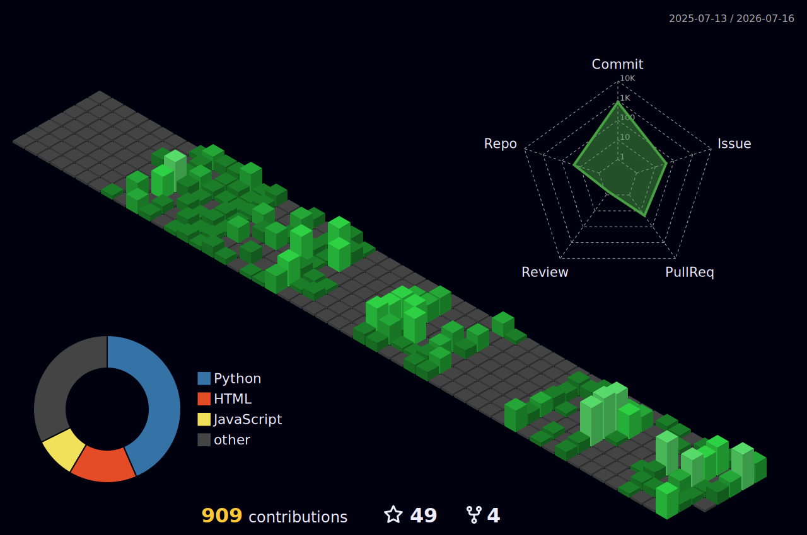

<!-- Gifs get in:
- ⭐ https://github.com/ViratiAkiraNandhanReddy/pixel-art-readme-gifs
- https://github.com/Anmol-Baranwal/Cool-GIFs-For-GitHub
- https://github.com/XoanOuteiro/GIFS_forReadme
-->

<strong>🎬 My Favorite Assets</strong>

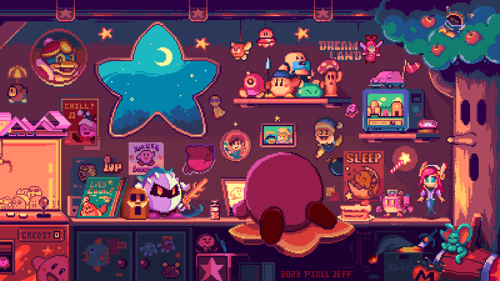

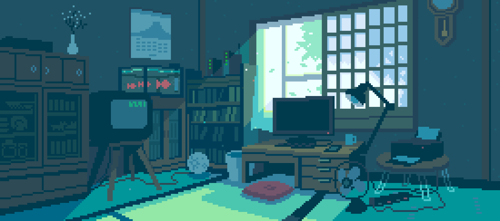

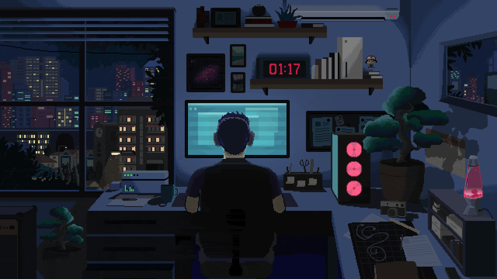

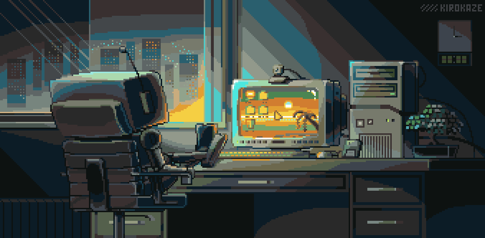

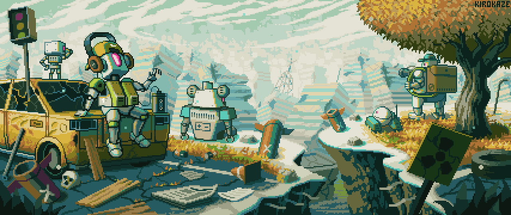

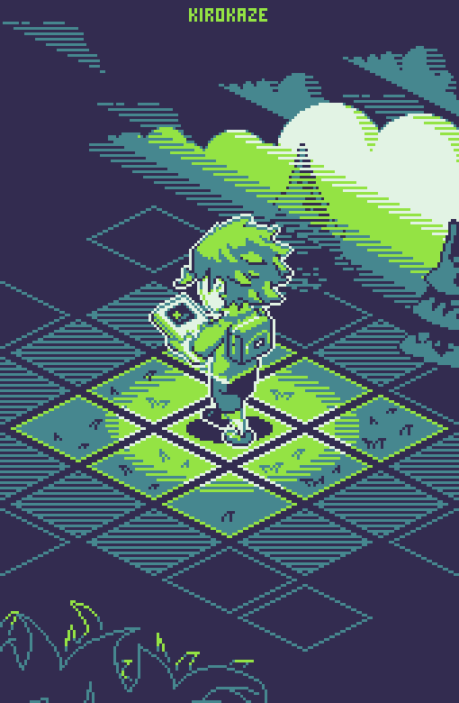

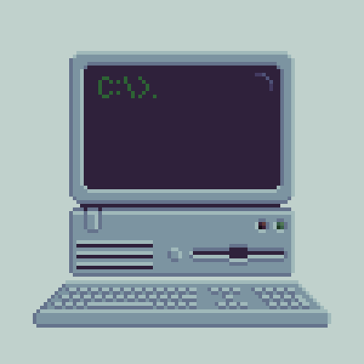

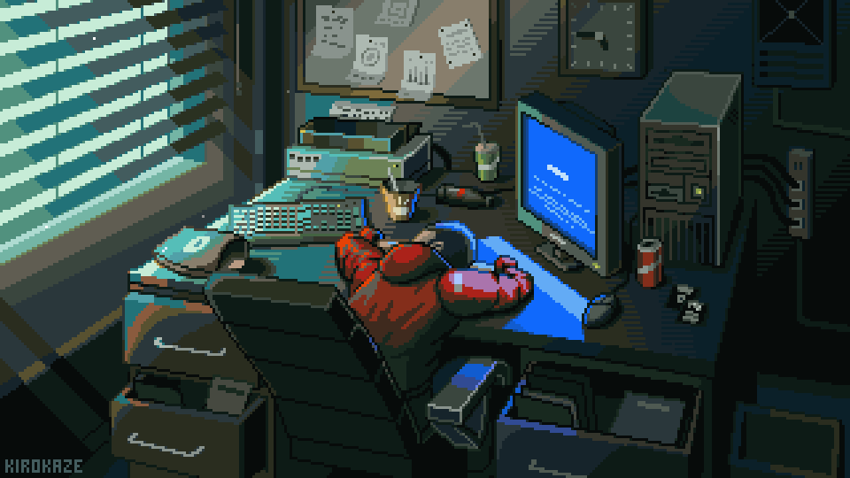

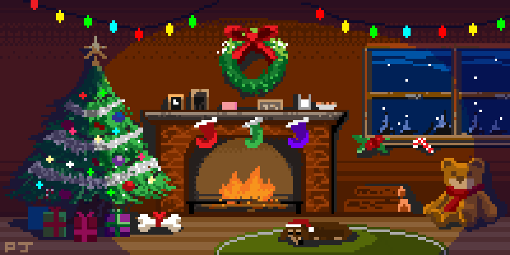

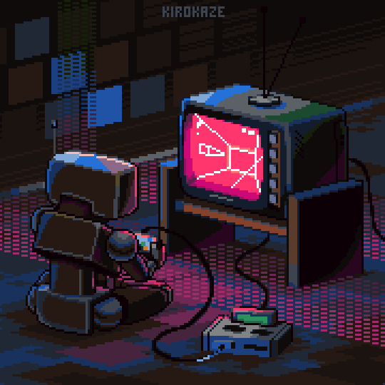

