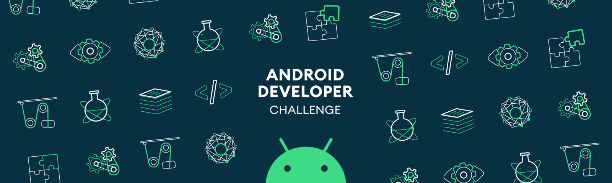

---

## 👤 About Me

Hi, I'm **Gabriel** 👋

I'm 16 years old and I'm from Brazil 🇧🇷.

I've been coding since I was 12. I currently work with **HTML, CSS, JavaScript, Python, and React**, and I'm interested in **low-level programming, cybersecurity, pentesting, and full-stack development**.

### 🌱 Interests

Besides programming, I enjoy learning about:
- 🔐 Cybersecurity, logic, and problem solving
- 🏛️ Ancient history, especially Ancient Egypt
- ✝️ Religious traditions such as Christianity, Buddhism, and Hinduism
- 👁️ Occultism, Hermeticism, symbolism, ancient philosophical traditions, and groups like Freemasonry
- 📚 Theology, philosophy, and different religious traditions

---

## 🚀 Stack

## 🔧 Tools

## 🌐 Communities

---

  
## 📊 GitHub Stats

<!-- 
Has moved from 
https://github-readme-stats.vercel.app/
to
+ https://github-stats-extended.vercel.app/

Find the repository in: https://github.com/stats-organization/github-stats-extended

-->
  
  
 

`flameastrogithub@gmail.com` • `astrusflame` • `u/flame77ofc`

<!-- Gifs get in:
- https://github.com/Anmol-Baranwal/Cool-GIFs-For-GitHub
-  
-->

<strong>🎬 My Favorite Assets</strong>

## Mario

<!-- https://user-images.githubusercontent.com/74038190/225813708-98b745f2-7d22-48cf-9150-083f1b00d6c9.gif -->

## Awesome Octocat

<!-- https://user-images.githubusercontent.com/74038190/212741999-016fddbd-617a-4448-8042-0ecf907aea25.gif -->

## Perfect Loop

<!-- https://private-user-images.githubusercontent.com/74038190/242390524-0c7eb6ed-663b-4ce4-bfbd-18239a38ba1b.gif?jwt=eyJ0eXAiOiJKV1QiLCJhbGciOiJIUzI1NiJ9.eyJpc3MiOiJnaXRodWIuY29tIiwiYXVkIjoicmF3LmdpdGh1YnVzZXJjb250ZW50LmNvbSIsImtleSI6ImtleTUiLCJleHAiOjE3ODM5ODA5MjUsIm5iZiI6MTc4Mzk4MDYyNSwicGF0aCI6Ii83NDAzODE5MC8yNDIzOTA1MjQtMGM3ZWI2ZWQtNjYzYi00Y2U0LWJmYmQtMTgyMzlhMzhiYTFiLmdpZj9YLUFtei1BbGdvcml0aG09QVdTNC1ITUFDLVNIQTI1NiZYLUFtei1DcmVkZW50aWFsPUFLSUFWQ09EWUxTQTUzUFFLNFpBJTJGMjAyNjA3MTMlMkZ1cy1lYXN0LTElMkZzMyUyRmF3czRfcmVxdWVzdCZYLUFtei1EYXRlPTIwMjYwNzEzVDIyMTAyNVomWC1BbXotRXhwaXJlcz0zMDAmWC1BbXotU2lnbmF0dXJlPWY3MmQzNDdjYzkwYmQ2MTk2MWI4MDczOTQ1MjViYjkyYmVhYTRkNGQ4MWExNjVhZjhlYjQ4OTdjZjdkNDZhNjImWC1BbXotU2lnbmVkSGVhZGVycz1ob3N0JnJlc3BvbnNlLWNvbnRlbnQtdHlwZT1pbWFnZSUyRmdpZiJ9.A9jPJgpK0yxyI4FdS_fYGwbMKS6LT8qMqVjaVKXS634 -->

## Night Chill

<!-- https://user-images.githubusercontent.com/74038190/212748830-4c709398-a386-4761-84d7-9e10b98fbe6e.gif -->

## Page not Found

<!-- https://private-user-images.githubusercontent.com/74038190/243328563-d0cfe7d1-0b8c-4e4a-9a66-875290ba6065.gif?jwt=eyJ0eXAiOiJKV1QiLCJhbGciOiJIUzI1NiJ9.eyJpc3MiOiJnaXRodWIuY29tIiwiYXVkIjoicmF3LmdpdGh1YnVzZXJjb250ZW50LmNvbSIsImtleSI6ImtleTUiLCJleHAiOjE3ODM5ODA5MjUsIm5iZiI6MTc4Mzk4MDYyNSwicGF0aCI6Ii83NDAzODE5MC8yNDMzMjg1NjMtZDBjZmU3ZDEtMGI4Yy00ZTRhLTlhNjYtODc1MjkwYmE2MDY1LmdpZj9YLUFtei1BbGdvcml0aG09QVdTNC1ITUFDLVNIQTI1NiZYLUFtei1DcmVkZW50aWFsPUFLSUFWQ09EWUxTQTUzUFFLNFpBJTJGMjAyNjA3MTMlMkZ1cy1lYXN0LTElMkZzMyUyRmF3czRfcmVxdWVzdCZYLUFtei1EYXRlPTIwMjYwNzEzVDIyMTAyNVomWC1BbXotRXhwaXJlcz0zMDAmWC1BbXotU2lnbmF0dXJlPTlhOTY4YTdjZmE0Mzg3M2NlN2ZkYTIzYzNkNGFiNmRhNTE2NjA2OGJmMjAxYzg2ZjY3NGY1NGZhZTRhMTJiYTgmWC1BbXotU2lnbmVkSGVhZGVycz1ob3N0JnJlc3BvbnNlLWNvbnRlbnQtdHlwZT1pbWFnZSUyRmdpZiJ9.-AYbkknS_xk1FLqVf6AqY-kSgbEfVZMRqRFUt-T8T1k -->

## Android Developer

<!-- https://user-images.githubusercontent.com/74038190/215768208-3bf3dda8-eeea-40ee-a58b-f5ac529685bf.gif -->

## Pacman

<!-- https://user-images.githubusercontent.com/74038190/212284158-e840e285-664b-44d7-b79b-e264b5e54825.gif -->

## Dinosaur Game

<!-- https://user-images.githubusercontent.com/74038190/212284136-03988914-d899-44b4-b1d9-4eeccf656e44.gif -->

## Eat Sleep Code Repeat

<!-- https://user-images.githubusercontent.com/74038190/212747657-7a8d59da-69c8-4110-8ea8-f8102fd0b413.gif -->

# Languages

<!-- https://private-user-images.githubusercontent.com/74038190/240304586-d48893bd-0757-481c-8d7e-ba3e163feae7.png?jwt=eyJ0eXAiOiJKV1QiLCJhbGciOiJIUzI1NiJ9.eyJpc3MiOiJnaXRodWIuY29tIiwiYXVkIjoicmF3LmdpdGh1YnVzZXJjb250ZW50LmNvbSIsImtleSI6ImtleTUiLCJleHAiOjE3ODM5ODIwMTEsIm5iZiI6MTc4Mzk4MTcxMSwicGF0aCI6Ii83NDAzODE5MC8yNDAzMDQ1ODYtZDQ4ODkzYmQtMDc1Ny00ODFjLThkN2UtYmEzZTE2M2ZlYWU3LnBuZz9YLUFtei1BbGdvcml0aG09QVdTNC1ITUFDLVNIQTI1NiZYLUFtei1DcmVkZW50aWFsPUFLSUFWQ09EWUxTQTUzUFFLNFpBJTJGMjAyNjA3MTMlMkZ1cy1lYXN0LTElMkZzMyUyRmF3czRfcmVxdWVzdCZYLUFtei1EYXRlPTIwMjYwNzEzVDIyMjgzMVomWC1BbXotRXhwaXJlcz0zMDAmWC1BbXotU2lnbmF0dXJlPTEzZWJmZjFjNWM5YmFlMzU4NWQyZTZmODBhNjA4NzRmMTNjNTJmZWFiYmJmMjViYWJmODRiMGI4NjkyOTdlYWQmWC1BbXotU2lnbmVkSGVhZGVycz1ob3N0JnJlc3BvbnNlLWNvbnRlbnQtdHlwZT1pbWFnZSUyRnBuZyJ9.2Ylx0bLpavh-GeP2jY8avd1uX2PGSN2Yst1luUrnkkY -->

